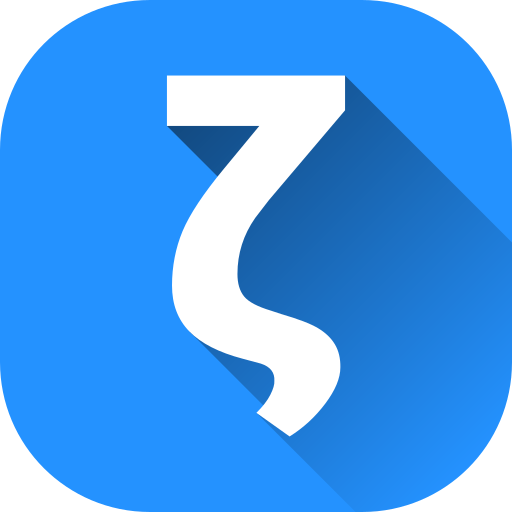
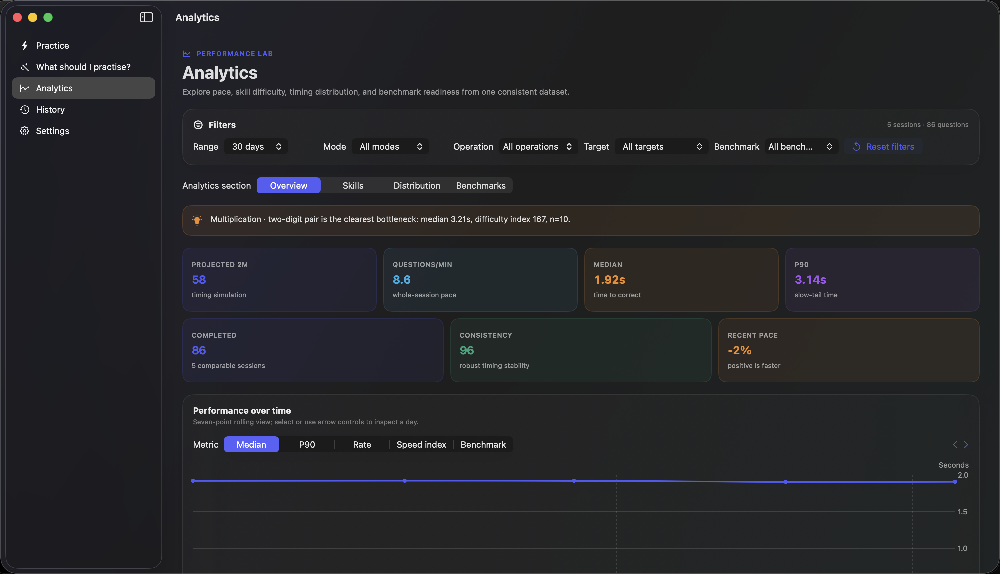
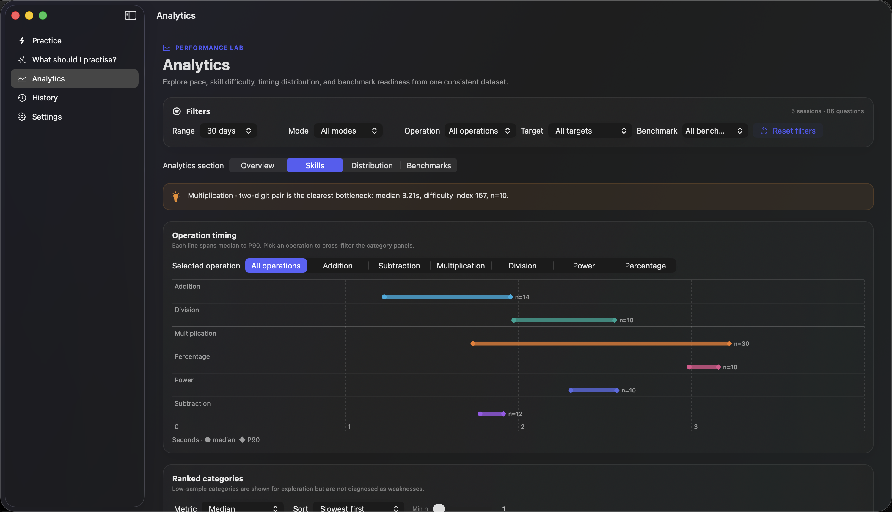
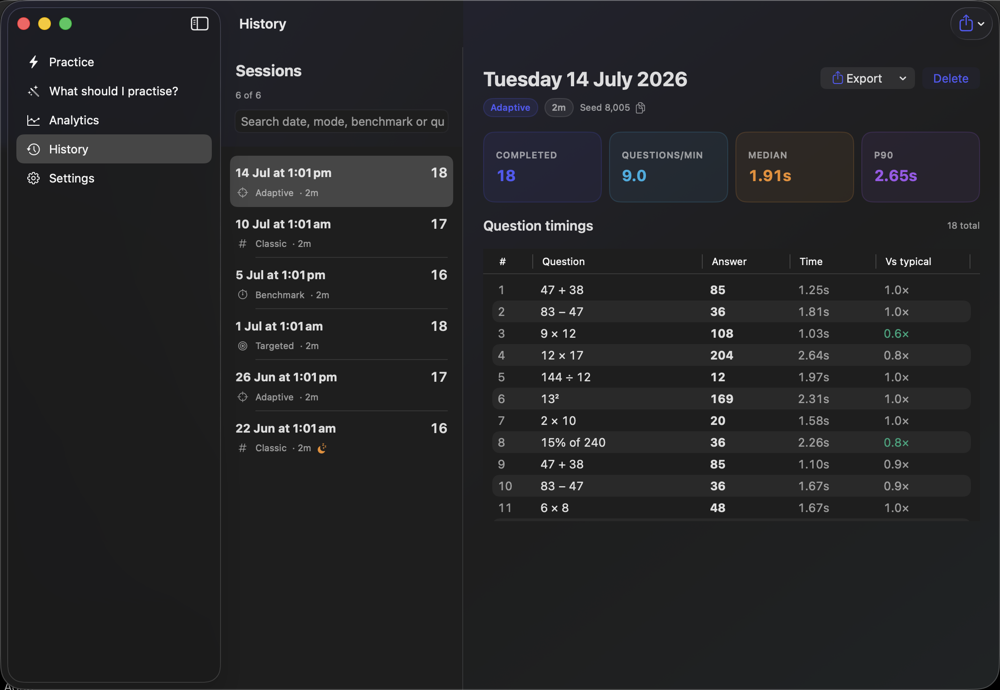
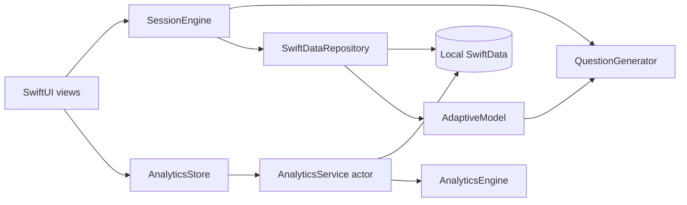

<div align="center">
  
  <h1>ZetaMax</h1>
  <p><strong>Deliberate mental arithmetic practice, built natively for Mac.</strong></p>
  <p>
    Adaptive drills, focused practice, comparable benchmarks, and genuinely useful
    on-device analytics—without an account, a backend, or a distraction in sight.
  </p>
  <p>
    
    
    
    
  </p>
  <p>
    <a href="#build-from-source">Build from source</a>
    ·
    <a href="docs/ARCHITECTURE.md">Architecture</a>
    ·
    <a href="CONTRIBUTING.md">Contribute</a>
    ·
    <a href="docs/PRIVACY.md">Privacy</a>
  </p>
</div>

---

ZetaMax is an open-source mental maths trainer for macOS. It turns each answer into a useful timing signal, then uses that history to reveal bottlenecks, recommend focused sessions, and make practice progressively more relevant.

The V01 release is being prepared for the Mac App Store. The complete native codebase is available here today.

<p align="center">
  
</p>

## Why ZetaMax

- **Practice with intent.** Choose a familiar mixed drill, let the adaptive model concentrate on slower categories, target a specific skill, or take a locked benchmark.
- **See pace, not just score.** Explore median and P90 response times, throughput, consistency, session pace, operand patterns, and performance over time.
- **Keep comparisons honest.** Benchmark profiles are duration-locked and versioned, and projections appear only after enough comparable data exists.
- **Stay in flow.** Correct answers advance automatically; the focused native answer field and keyboard shortcuts keep interaction fast.
- **Own your history.** Practice data stays on the Mac and can be exported as CSV or JSON whenever you choose.

## Practice modes

| Mode | Best for | What it does |
| --- | --- | --- |
| **Classic** | Everyday mixed practice | Configurable operations, operand ranges, and sessions from 15 seconds to 60 minutes |
| **Adaptive** | Improving weak areas | Reweights question categories using timing, recent slowdown, recency, and uncertainty while preserving exploration |
| **Targeted** | Focused preparation | Includes two-digit multiplication, exact division, negative subtraction, powers, percentages, decimals, and a quant interview mix |
| **Benchmark** | Tracking comparable scores | Provides locked, versioned profiles at 30 seconds, 1, 2, 5, and 10 minutes |

## A private performance lab

ZetaMax derives its analytics entirely on device:

- a filterable overview with projected score, rate, median, P90, consistency, and trend comparisons;
- skill analysis by operation, category, and operand;
- response-time distributions, slow completions, and pace through a session;
- benchmark projections, results, profiles, and personal bests;
- recommendations that can prepare a focused 45-second adaptive session.

Analytics calculations run away from the main UI, reuse in-flight work, and keep a bounded cache for responsive navigation. Incomplete or interrupted sessions remain visible in history but do not enter comparable performance metrics.

<table>
  <tr>
    <td width="50%">
      
    </td>
    <td width="50%">
      
    </td>
  </tr>
  <tr>
    <td align="center"><sub>Skill and operand analysis</sub></td>
    <td align="center"><sub>Searchable session history</sub></td>
  </tr>
</table>

## Availability

**Mac App Store:** coming with V01.

No public App Store link has been published yet. Until then, contributors and early testers can run ZetaMax directly from Xcode.

## Build from source

### Requirements

- macOS 14 Sonoma or later
- Xcode 15 or later
- Git

ZetaMax has no third-party package dependencies.

### Run locally

```bash
git clone https://github.com/Ayush-Singh-31/ZetaMax.git
cd ZetaMax
open ZetaMax.xcodeproj
```

In Xcode, select the **ZetaMax** scheme and **My Mac**, then press <kbd>⌘R</kbd>.

You can also build from Terminal:

```bash
xcodebuild build \
  -project ZetaMax.xcodeproj \
  -scheme ZetaMax \
  -configuration Debug \
  -destination 'platform=macOS' \
  -derivedDataPath .build/DerivedData
```

The first local build may require selecting your development team in **Signing & Capabilities**.

### Run the tests

Run the complete unit and UI suite:

```bash
xcodebuild test \
  -project ZetaMax.xcodeproj \
  -scheme ZetaMax \
  -destination 'platform=macOS' \
  -derivedDataPath .build/DerivedData
```

To run only the faster unit suite, add `-only-testing:ZetaMaxTests`. macOS UI tests require an unlocked desktop session and Accessibility permission for Xcode when prompted.

## Using ZetaMax

1. Open **Practice** and choose a mode.
2. Configure the duration, operations, range, target, or benchmark profile.
3. Start a session and type the answer shown.
4. A correct answer advances immediately. Press <kbd>Return</kbd> to record an incorrect submission and continue editing.
5. Review the result, then visit **Recommendations**, **Analytics**, or **History** as your dataset grows.

### Keyboard shortcuts

| Action | Shortcut |
| --- | --- |
| Start a configured session | <kbd>⌘</kbd> + <kbd>Return</kbd> |
| Submit the current entry | <kbd>Return</kbd> |
| End a running session | <kbd>Esc</kbd> |
| Open sidebar sections, Practice through Settings | <kbd>⌘1</kbd> through <kbd>⌘5</kbd> |

## Data and privacy

ZetaMax does not require an account and contains no advertising, tracking SDK, telemetry service, or application backend. Session history, attempts, submitted answers, timings, and derived skill estimates are stored in the app’s local SwiftData container.

Exports happen only after an explicit user action through the macOS file picker. All practice data can be deleted from **Settings**.

Read the complete [privacy policy](docs/PRIVACY.md) and [security policy](SECURITY.md).

## Under the hood

ZetaMax is a native SwiftUI application organized around a few explicit boundaries:



The generator is seedable for deterministic tests and reproducible sessions. Persistence is isolated behind an attempt repository, while analytics operate on immutable sendable inputs off the main actor. See [Architecture](docs/ARCHITECTURE.md) for the full model and data flow.

## Project status

V01 focuses on a polished, offline-first Mac experience:

- native practice, recommendations, analytics, history, and settings;
- responsive compact, medium, and wide layouts in light and dark appearances;
- deterministic generation and resilient session recovery;
- CSV and JSON exports with a versioned schema;
- unit, integration, performance-fixture, and macOS UI coverage.

Release notes are maintained in the [changelog](CHANGELOG.md). App Store preparation and known submission work are tracked in the [V01 release dossier](docs/APP_STORE_RELEASE.md).

## Contributing

Thoughtful contributions are welcome. Start with [CONTRIBUTING.md](CONTRIBUTING.md), follow the [Code of Conduct](CODE_OF_CONDUCT.md), and use the issue templates for bugs or proposals.

If you have found a security issue, please follow [SECURITY.md](SECURITY.md) instead of opening a public issue.

## Support

For troubleshooting, common questions, and the information to include with a report, see [SUPPORT.md](SUPPORT.md).

## License

ZetaMax is available under the [MIT License](LICENSE).

<div align="center">
  <br>
  <sub>Designed for focused practice. Built with Swift, statistics, and respect for your data.</sub>
</div>
