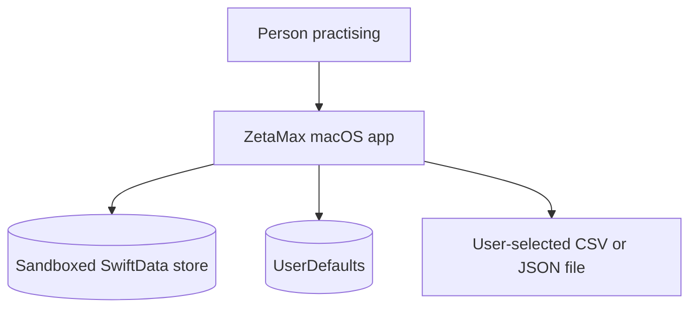
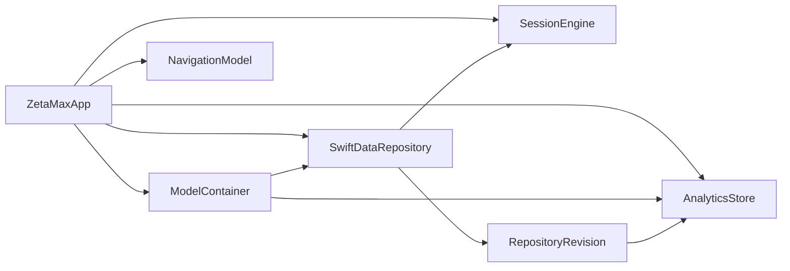
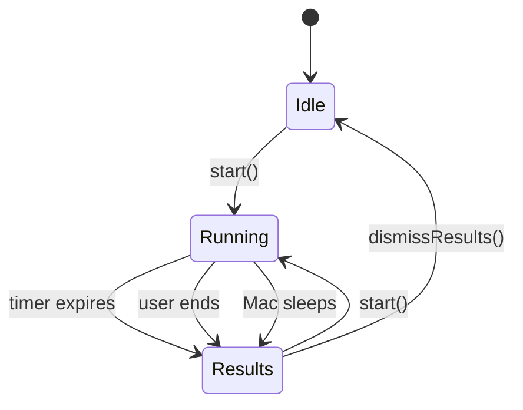
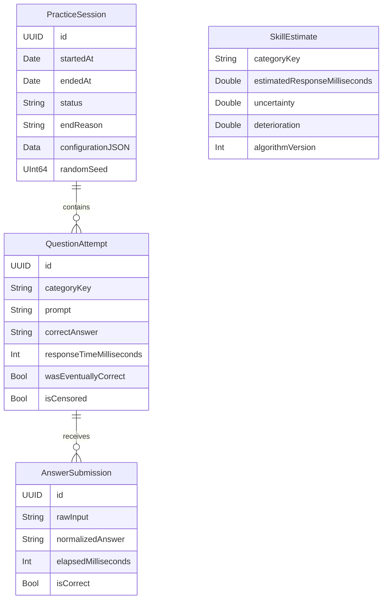
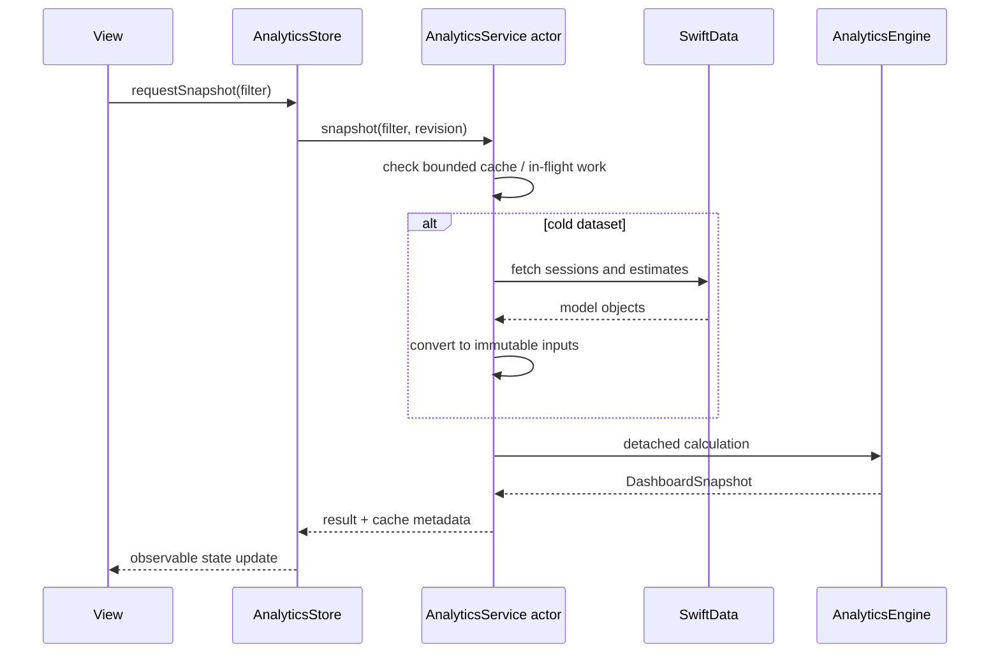

# ZetaMax Architecture

This document describes the V01 codebase: its boundaries, data flow, invariants, and the reasoning behind the pieces that should remain explicit as the app evolves.

## System context

ZetaMax is a single-process, offline-first macOS application. There is no application server, authentication layer, remote database, or third-party runtime dependency.

SwiftUI renders the application. SwiftData owns durable practice history. `UserDefaults` stores lightweight preferences. Analytics and adaptive calculations operate on that local history.

## Source layout

| Area | Primary types | Responsibility |
| --- | --- | --- |
| `App` | `ZetaMaxApp` | Composition root, scene, menu commands, data container, startup recovery |
| `Domain` | `PracticeConfiguration`, `BenchmarkProfile`, `GeneratedQuestion` | Shared value types and validation |
| `Engine` | `SessionEngine`, `QuestionGenerator`, `AdaptiveModel` | Live session state, generation, adaptive weighting |
| `Models` | `PracticeSession`, `QuestionAttempt`, `AnswerSubmission`, `SkillEstimate` | SwiftData entities and relationships |
| `Persistence` | `SwiftDataRepository`, `DataStore`, `ExportService` | Durable mutations, recovery, deletion, export |
| `Analytics` | `AnalyticsEngine`, `AnalyticsService`, `AnalyticsStore` | Pure calculations, async caching, view-facing state |
| `Views` | Screens and `ZetaTheme` components | Native macOS presentation and responsive behavior |

Tests follow behavior rather than mirroring every source file:

- `ZetaMaxTests` covers generation, persistence, statistics, analytics, session timing, caching, cancellation, and revisions.
- `ZetaMaxUITests` covers answer interaction, navigation, accessibility behavior, appearances, responsive layouts, and analytics screens.

## Composition root

`ZetaMaxApp` creates long-lived dependencies on the main actor:

1. `DataStore` creates the SwiftData `ModelContainer`.
2. `SwiftDataRepository` wraps its main context.
3. Startup recovery marks unfinished sessions as interrupted.
4. Missing or obsolete skill estimates are rebuilt from history.
5. `AnalyticsStore` receives the container and repository revision source.
6. `SessionEngine` receives the attempt repository.
7. `AppRootView` receives those shared instances.

UI tests replace the durable store with an in-memory container and can seed deterministic analytics fixtures through launch arguments.

## Domain configuration

`PracticeConfiguration` is a codable snapshot of everything required to reproduce a session:

- schema version;
- practice mode and duration;
- enabled arithmetic operations;
- addition and multiplication operand ranges;
- targeted preset and range;
- adaptive focus;
- benchmark identifier and version.

`validated` normalizes ranges, enforces supported operations, bounds duration to 15–3,600 seconds, and clamps adaptive focus. The validated configuration is persisted with each session rather than reconstructed from current settings.

### Practice modes

- **Classic** selects uniformly from configured core operations.
- **Adaptive** generates candidates, then favors categories according to current weights.
- **Targeted** delegates to a preset-specific generator.
- **Benchmark** uses a locked, versioned `BenchmarkProfile`.

Built-in benchmark durations are 30, 60, 120, 300, and 600 seconds. The profile identity includes a version so future changes do not silently mix incompatible scores.

## Session lifecycle

`SessionEngine` is a main-actor observable state machine.

Starting a session:

1. validates and persists the configuration;
2. generates or accepts a signed-database-safe random seed;
3. creates a `PracticeSession` immediately;
4. constructs the seeded `QuestionGenerator`;
5. loads adaptive weights when needed;
6. establishes a deadline using a monotonic clock;
7. persists and presents the first attempt;
8. starts a cancellable timer task.

### Answer handling

The focused native text field sends every edit to `answerDidChange`.

- A parseable correct value is persisted and advances immediately.
- A non-empty incorrect value is persisted only when explicitly submitted.
- `submittingAttemptID` prevents duplicate completion of the same attempt.
- The engine re-checks the deadline before accepting a correct answer.
- Decimal parsing accepts the current locale’s decimal separator and stores a POSIX canonical representation.

### Timing invariant

Durations use `ProcessInfo.systemUptime` through the `MonotonicClock` protocol. Wall-clock dates are recorded for history, but never trusted for elapsed response time. Unit tests inject `ManualClock` to exercise boundary behavior deterministically.

### Interruption recovery

The running session is marked interrupted when the Mac announces sleep. If the process ends before clean completion, `recoverInterruptedSessions` marks any persisted `inProgress` session as recovered on the next launch.

Interrupted sessions remain inspectable but `PracticeSession.isComparable` is false, excluding them from adaptive and benchmark comparisons.

## Question generation

`QuestionGenerator` owns `SplitMix64`, a small deterministic random-number generator. A session seed therefore produces a stable question sequence for a stable algorithm and configuration.

Core generation uses inverse construction to preserve useful invariants:

- subtraction reverses a generated addition, producing the configured answer range;
- division reverses a multiplication, guaranteeing a nonzero divisor and exact integer quotient.

Targeted generation adds negative results, squares and cubes, finite percentages, decimal arithmetic with at most two places, and a mixed quant-interview distribution.

Every question receives a semantic category derived from its operation, kind, operand shape, and relevant difficulty feature. These stable category keys connect generation, adaptive estimates, recommendations, and analytics.

## Persistence model

Relationships from session to attempt and attempt to submission use cascade deletion. `SwiftDataRepository` centralizes mutations so relationship updates, saves, revision publication, and estimate rebuilds happen together.

`SkillEstimate` is a rebuildable cache, not primary user history. Its `algorithmVersion` triggers reconstruction when adaptive semantics change.

### Search

Each session maintains denormalized searchable text containing mode, benchmark or target context, date, prompts, and category names. Existing sessions with a missing index are repaired at launch.

### Revision signaling

`RepositoryRevision` advances after completed mutations that can change analytics. `AnalyticsStore` observes it and invalidates stale datasets, cached results, and in-flight requests before refreshing requested views.

## Adaptive model

Adaptive model version 3 derives category estimates from comparable sessions.

Severity combines:

| Signal | Weight | Meaning |
| --- | ---: | --- |
| Relative time to correct | 50% | Category timing above the global median |
| Recent deterioration | 25% | Slowdown in the recent timing window |
| Recency | 15% | Time since the category was practised |
| Uncertainty | 10% | Limited evidence for the estimate |

The focus slider adjusts the sampling temperature. Ten percent of probability remains exploratory so a concentrated session does not permanently starve other known categories.

Right-censored observations are supported so an unfinished question can contribute a conservative timing bound without being treated as a successful completion.

## Analytics pipeline

Analytics are split into three layers:

### `AnalyticsEngine`

The engine is a pure calculation namespace over immutable, sendable inputs. It produces a `DashboardSnapshot` containing:

- throughput and timing percentiles;
- category-normalized speed and consistency;
- operation and category metrics;
- daily or weekly trends;
- response-time distributions;
- pace through a session;
- operand explorers and slow completions;
- benchmark projections, profiles, results, and personal bests;
- prior-period comparisons and a generated insight.

Metrics operate on comparable sessions. Operation filters are applied to every attempt-derived value so labels and results remain aligned.

Expected benchmark scores use a deterministic 1,000-run simulation over observed timing blocks. A projection requires at least three duration-compatible sessions and 20 completed observations.

### `AnalyticsService`

The actor owns:

- a revision-scoped immutable dataset;
- a 16-entry least-recently-used snapshot cache;
- shared in-flight calculations with independent waiters;
- separate recommendation and history-baseline caches;
- cancellation and stale-revision handling.

SwiftData objects do not cross into detached tasks. They are converted into immutable analytics inputs first.

### `AnalyticsStore`

The main-actor store translates view requests into service tasks, debounces filter changes, guards responses with request identifiers, exposes loading and error state, and prewarms the default 30-day snapshot.

## Export contracts

`ExportService` creates a SwiftUI `FileDocument` only after a user requests an export.

- CSV schema version `2` writes one row per question attempt, quotes every field, and joins submitted raw answers with `|`.
- JSON schema version `2` writes a sorted, pretty-printed envelope with sessions, attempts, and submissions.
- Dates use ISO 8601 in both formats.
- Sessions and attempts are sorted for deterministic output.

Schema versions refer to the export contract and are independent from `PracticeConfiguration.schemaVersion` and `AdaptiveModel.algorithmVersion`.

## UI architecture

`AppRootView` switches between a distraction-free running/results flow and a sidebar-based idle application.

`ZetaTheme` supplies shared colors, layered surfaces, cards, metric tiles, chart cards, status chips, and responsive pairs. Views honor system appearance plus explicit light and dark choices.

Responsive behavior is intentional:

- minimum window size: 860 × 620;
- default window size: 1,100 × 760;
- history changes between split and compact list/detail navigation;
- charts and card layouts adapt rather than assuming one fixed width.

Custom and chart content includes accessibility labels. Motion and transparency effects check the relevant accessibility environment preferences.

## Architectural invariants

Changes should preserve these properties:

1. A persisted session contains the validated configuration and seed needed to explain its questions.
2. Elapsed timing comes from a monotonic clock.
3. One attempt can complete at most once.
4. Interrupted sessions do not enter comparable metrics.
5. SwiftData models do not cross detached-task boundaries.
6. Analytics responses are revision-aware and cancellable.
7. Sparse data never implies unsupported precision.
8. Adaptive estimates remain rebuildable from primary history.
9. Export and benchmark contracts are explicitly versioned.
10. Practice data is local unless the privacy model is deliberately and publicly changed.

## Extension points

- Add a target by extending `TargetedPreset`, its metadata, and `QuestionGenerator.targeted`, then cover it with deterministic invariants.
- Add a dashboard metric in `DashboardSnapshot` and `DashboardMetric`, calculate it from filtered inputs, and provide sparse and prior-period tests.
- Change adaptive semantics by incrementing `AdaptiveModel.algorithmVersion` and verifying startup rebuilding.
- Change an export contract by incrementing the relevant export schema version and documenting compatibility.
- Change stored models only with a migration plan and on-disk tests.

See [CONTRIBUTING.md](../CONTRIBUTING.md) for the review and test expectations that accompany these changes.
